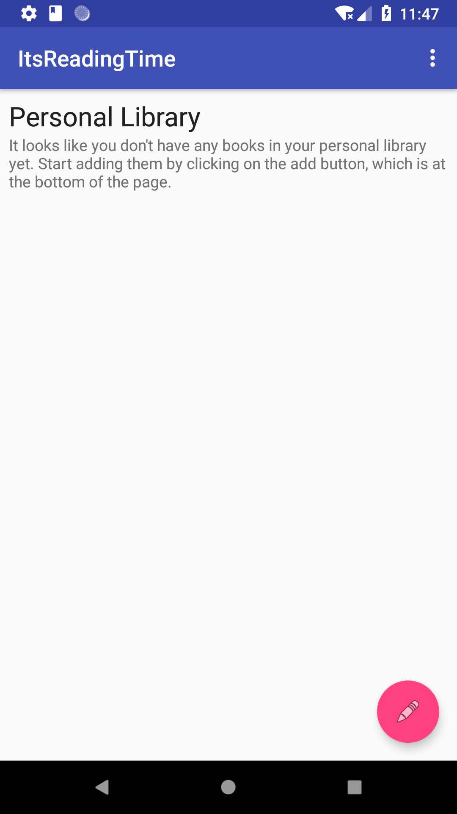

# ItsReadingTime
Android Project that motivates people to read more! =D

## Summary
    * Overview
    * Functionalities
    * Help us make it better
    
## Overview

Sometimes we get overwhelmed with our daily chores and we end up forgetting about
ourselves. Developing the reading habit is a good way to let stress out of our 
lives. So, in order to help you develop this habit, we have created a very handy
tool, which its main goal is to remind you that "It's reading time" !!!!

We know that, after sometime of use, you will develop the reading habit and we'll 
no longer be necessary to you. That's perfectly ok! We understand you, no hard
feelings =D

Well, we hope you enjoy it and let us know what you think of it!

## Functionalities

